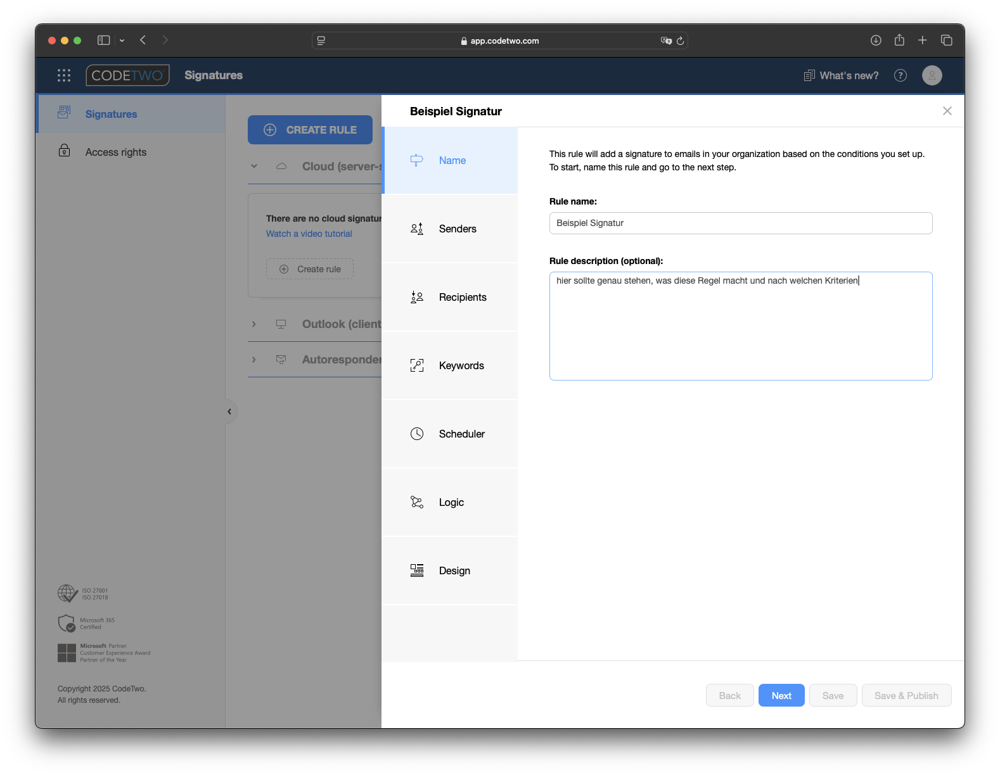

# Code Two Email Signatures für Microsoft 365 und Office 365

## Einleitung

ermöglicht Ihnen das Erstellen und Verwalten von E-Mail-Signaturen, Haftungsausschlüssen, automatischen Antworten und Marketingkampagnen für alle Benutzer in Ihrer Microsoft 365-Organisation. Es ist ein Cloud-Dienst, der mit allen E-Mail-Apps und -Geräten funktioniert, einschließlich Windows, Mac, Handys und Tablets.

## Hauptteil

### Einsatzzweck der Software

Mit Code-Two werden alle Signaturen vereinheitlicht und ohne Konfigurationsaufwand seitens des Nutzers anhand von Regeln automatisch aus seinem AD Profil ausgelesen und generiert.

### Funktion

Code Two fungiert sozusagen wie ein Gateway fuer Emails. Dabei werden die Emails bevor sie gesendet werden um die eingestellte Signatur erweitert. Code Two kann dabei in 3 verschiedenen Modus benutzt werden.

- **Cloud-Modus**
Kompatibel mit allen E-Mail-Clients. Eine Signatur wird nach dem E-Mail-Versand eingefügt (Sie können aber deren Vorschau beim Verfassen der Nachricht direkt in Outlook für Windows, Mac und in Outlook im Web (OWA) anzeigen, indem Sie das CodeTwo Web Add-In für Outlook bereitstellen). Die Konfiguration von Microsoft 365-Konnektoren ist erforderlich. Die Bereitstellung des Add-ins ist nicht nötig.

- **Outlook-Modus**
Kompatibel mit Outlook für Windows, Outlook für Mac, OWA und Outlook für iOS und Android. Eine Signatur wird beim E-Mail-Schreiben eingefügt. Die Konfiguration von Microsoft 365-Konnektoren ist nicht nötig (Ihre E-Mails werden nicht durch den Dienst von CodeTwo geleitet). Die Bereitstellung des CodeTwo Web Add-ins für Outlook ist erforderlich.

- **Combo-Modus**
Kompatibel mit allen E-Mail-Clients. Er fasst den Cloud- und den Outlook-Modus zusammen. Eine Signatur wird beim E-Mail-Schreiben in Outlook und nach dem E-Mail-Versand in anderen E-Mail-Clients eingefügt. Die Konfiguration von Microsoft 365-Konnektoren und die Bereitstellung des CodeTwo Web Add-ins sind erforderlich.

### Lizenzmodell/Preise

lizenzen werden pro User vergeben. Die Lizenzen fangen ab 10 User mit 1,36EUR pro User/Monat an.
Werden mehr Nutzer sowie laengere Abrechnungszeitraeume bestellt (Monat->Jahr) werden die Lizenzen billiger.

[Code Two Lizenzmodell](https://www.codetwo.de/email-signatures/preise#scrollTo)

Die Lizenzen weden ueber ein Admin Panel verwaltet.

### Fehlervermeidung

falls Probleme im vorhinen bekannt sind, oder man gewisse Workarounds braucht um das system zu installieren, gehoert es hier hin. Links in die quellen

## Einstellung

Einloggen über [App.codetwo.com](https://app.codetwo.com)

nachdem man sich eingeloggt hat, kann man entweder links oben über "Create Rule" eine neue Regel hinzufügen, oder in dein einzelnen Bereichen eine neue Regel hinzufügen.
Eine Erklärung der einzelnen Bereiche sind weiter oben unter Funktion

### Generelles Regel Design

In den Regeln selbst kann definiert werden, was passiert wenn die Regel nicht greift. Im Standard wird dann  die nächste Regel in der Kaskade angewendet. Das bedeutet, die Regel-Kaskade sollte von der speziellsten zur allgemeinsten Regel konzipiert werden.

### Beispiel einer Regel
Als Beispiel erstellen wir eine neue Cloud Regel:
Cloud aufklappen, unten über "create rule" eine neue Regel erstellen

#### Name
Auf der linken Seite sind die verschiedenen Teile abgebildet, die man teilweise ausfüllen muss, damit die Regel greift.
Als erstes sollte ein kurzer Name gegeben werden, am besten nach einem klaren Schema.
Dazu eine genaue Beschreibung, damit man sofort sieht was die Regel tun soll, falls sie angepasst werden muss.

#### absender
Unter Senders kann im ersten Feld festgelegt werden, auf wen die Regel zutrifft, entweder alle User, einzelne User, Gruppen, über AD Filter oder Email Adressen ausgewählt.
Im zweiten Feld kann ich ausnahmen von den oben ausgewählten definieren.
Sinnvoll ist es hier natürlich, alle Regeln über die Gruppen der AD zu organisieren.

#### Empfaenger
Nach dem gleichen Schema kann nur eingestellt werden, für welchen Empfänger die Signatur angehängt wird. Hier kann zwischen Alle, Intern, Extern, Gruppen (in der OU) und email adressen unterschieden werden.
Im zweiten Feld wieder die Ausnahmen aus der vorherigen Auswahl.

#### Keywords (optional)
es koennen Keywords verwendet werden um eine Regel weiter zu filtern. Auch hier kann entschieden werden, ob das Keyword enthalten sein muss, um die Regel auszuloesen oder ein Keyword die Regel unterdrueckt.

Es koennen einzelne Woerter oder ganze Phrasen, sowie ein * als Pre/Suffix verwendet werden. Ausserdem wird noch unterschieden, ob das Keyword im Betreff, Text der email oder eins von beidem sein muss
Zusaetzlich kann man sogar nocht das Keyword aus der mail entfernen lassen.

#### Scheduler(optional)
Ueber den Scheduler kann die Regel auch Zeitlich gesteuert werden. Dazu muss als erstes die Zeitzone angegeben werden. Es koennen dann komplett freie Zeitintervalle eingegeben werden (sowas wie generelle Feiertage wie Weihnachten) mit Datum und Zeit, oder taeglich/woechentlich/monatlich wiederkehrende Zeiten angegeben werden.

#### Logik
Unter Rules kann die Kaskade aufgebaut werden. 
Hierzu wird erst entschieden, ob nach erfolgreichem Anweden der Regel die naechste Regel auf der Liste abgearbeitet werden soll, oder nicht.
Danach wird entschieden, was passiert wenn die Regel nicht angewendet wurde.
Ueber dieses Logic koennen nun Kaskaden aufgebaut werden. Dabei sollte man vom Sonderfall zu immer allgemeineren Faellen gehen.

## Quellen / weitere ressourcen

Falls es quellen oder links zu updates gibt, hier rein
